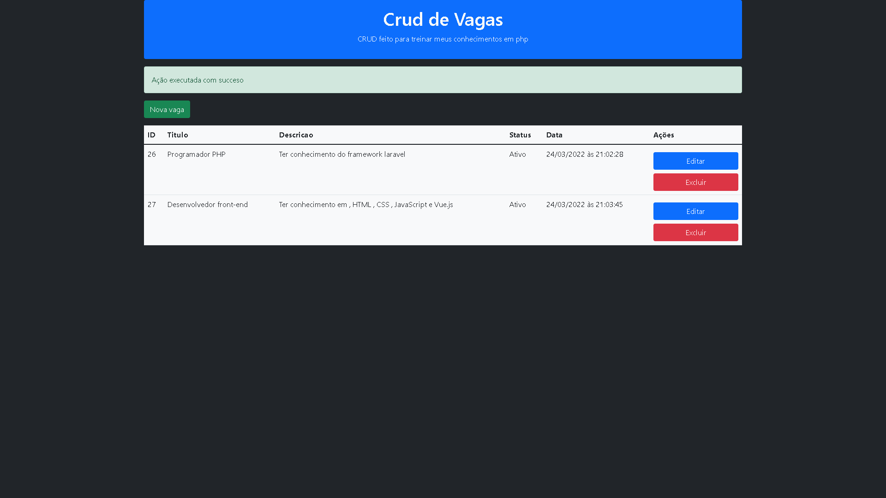
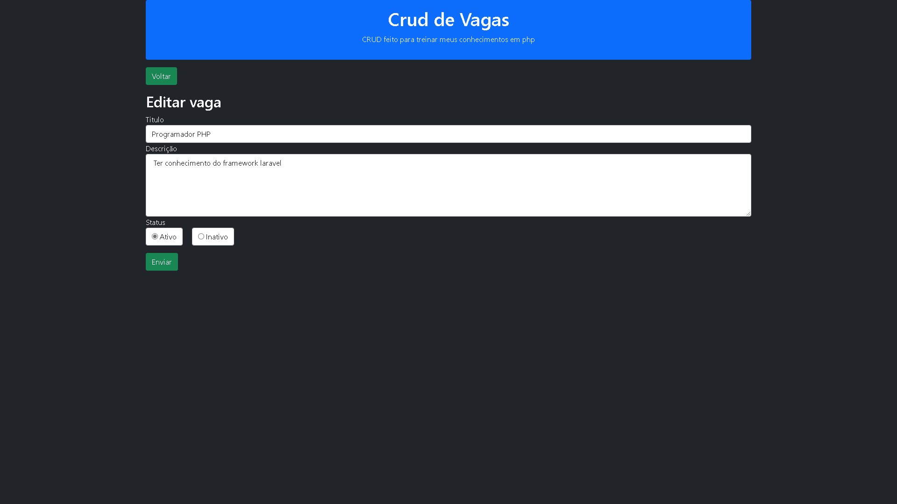
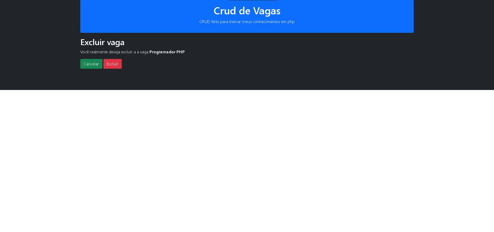

# CRUD-PHP: Cadastro de Vagas 

## Descrição

O projeto consiste em um CRUD, onde o usuário , pode cadastrar um vaga , sua descrição e seu status. Após cadastrada a vaga pode ser alterada ou excluida.

## Tecnologias utilizadas

- HTML
- CSS
- BOOTSTRAP
- PHP

## Como testar

- Instale o xampp ou semelhante.
- clone o projeto para o repositorio do servidor local do xampp
- Inicialize o xampp e o servidor local
- Acesse o projeto através do localhost do Browser.

## Imagens

  <h3>Tela inicial inicial</h3>
  </img>
  <h3>Tela de edição</h3>
  </img>
  <h3>Tela de exclusão</h3>
  </img>
  

